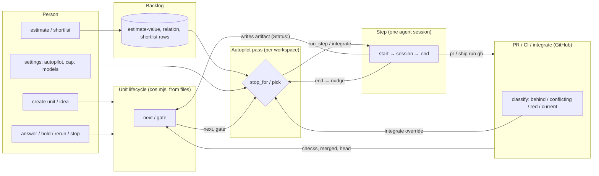

# coscc as state machines — as-is map, 2026-09-28

Written by Leif for the originator, to see the whole picture before the FSM/DB work. Every
fact was read from the code on `main` at `088101e` (v0.14.0); paths are cited so each one can
be checked. Nothing here is a design yet — section 6 lists what the redesign must decide.

Who decides a transition:

- **CODE** — deterministic: `cos.mjs`, the app's Python, git/gh reads.
- **AGENT** — an LLM session's free-form output (a `Status:` it wrote, a verdict, a JSON reply).
- **PERSON** — a route or a button on the board.

## 0. The machines and how they connect



The unit's state is **not stored anywhere**: `cos.mjs` recomputes it on every read from the
markdown files, git and `gh`. The app keeps its own facts (steps, picks, stops, holds'
effects, answers, shortlist, estimates, settings) as rows in `~/.cos/cos.db` table `runs`
and `prefs`. The two halves meet through `cos.mjs status/next/gate` called as a subprocess
(`coscc/units/board.py:44-415`).

## 1. Unit lifecycle (per unit) — `cos.mjs`

### 1.1 States per artifact

| Artifact | Statuses | Written by |
|---|---|---|
| idea | draft, accepted, rejected — optional, but a *draft* idea blocks `next` (`cos.mjs:32,1236,1255`) | PERSON (brief, written `accepted` by the app) or AGENT write-idea |
| intent | draft, accepted, rejected (`:33`) | AGENT (prose; the app writes the reply) |
| spec | draft, accepted, rejected, **skipped** — never used on 90 shipped units (`:34`) | AGENT (prose) |
| spike | draft, accepted, rejected; only when spec `## Concerns` has `[unmeasured] U<n>` (`:35,1122-1126`) | AGENT (prose) |
| plan | draft, accepted, rejected, **done** (terminal, `:36,1196`) | AGENT (prose) |
| impl | draft, accepted, rejected, done (`:37`) | AGENT (tools; writes the file itself) |
| pr | draft, accepted, rejected; `PR: <url>` (`:38,469`) | AGENT (tools, runs `gh pr create`) |
| review | draft, changes-requested, accepted, rejected; rounds `## Round N` + `Verdict: pass/changes-requested/needs-person/incomplete` (`:43,517-522`) | AGENT (prose); `incomplete` by the app's closing turn |
| ship | draft, accepted, rejected; `Round:`, `Refused:` (`:44,728`) | AGENT (tools, runs `gh pr merge`) |

Derived states (CODE, recomputed each read):

- **settled** = accepted | skipped | done (`:1109`); **missing** file vs **unreadable** (no `Status:`).
- **stale** = intent has a `### Rerun` block whose `Stale:` hash equals the artifact's current text hash (`:886-898`).
- **held** = last valid `### Paused|Dropped|Resumed` block in intent `## Answers` (`:193-229`); moves active→paused/dropped, paused→dropped/active, dropped→paused (`:200`).
- **rejected** anywhere closes the unit (`:1239`).
- **open questions** = numbered items with `?` under `## Open questions` without a `### Câu N` answer (`:112-126,348`). They gate nothing in `cos.mjs`; a *draft* does (`:451,1255`).
- **review rounds used** / **out of rounds** (`COS_REVIEW_ROUNDS`, default 3, plus `### More rounds`) (`:1345-1364`).
- **dependency merged** = the snapshot's `merged` for that unit: the PR machine's `merge-read` row, or, for a unit it never moved, a `ship.md: accepted` from the `0135` import or a `ship` session (`0139` R5, `units/meta.py` `snapshot`).

### 1.2 `next` — first match wins (`cos.mjs:1190-1322`)

| why | condition | offers stage |
|---|---|---|
| finished | plan done, or every stage settled | — |
| paused / dropped | hold | — |
| unreadable | bad `[unmeasured]` ids, file without `Status:`, broken idea link | — |
| needs-person | spike fails at round ≥ 2; review out of rounds; incomplete review past the limit | — |
| spike-fails / spike-missing | spike accepted with fails / a U<n> without verdict | spec / spike |
| missing | artifact absent | that stage |
| rejected | any artifact rejected | — |
| stale | rerun made it stale | that stage |
| review-incomplete | incomplete or unfinished round | review |
| ship-refused | ship draft with `Round:` | — (see 1.3) |
| draft | "finish and accept X" (+ `rerun` when all its questions are answered and the stage is in intent/spec/spike/plan/impl) | — |
| awaits-person / person-answered | needs-person round with unanswered / answered `F<n>` | — / review |
| changes-requested | review asked for changes | → refined by `nextStep` |
| dependency | any answer whose stage is impl, while a `Depends on:` unit is unmerged | — |

`nextStep` (`:2158-2280`) refines review/ship/changes-requested with **git + gh** reads:
CI green → review; CI red → impl; PR merged → ship "record, do not merge"; head moved after a
pass → review again (or "needs a person" if a second pass lands on the same head); clean
rebase + CI red → impl; changes-requested → impl if code must change, else review.

### 1.3 Gates (`cos.mjs:2046-2097`) — all CODE

- every stage: not held; every earlier required stage exists, is settled and not stale; spike only when required; plan waits for every `U<n>` `Verdict: holds`.
- impl: + idea links resolve and every `Depends on:` is merged (`:2094`).
- review: + `PR:` present, not out of rounds, `gh pr checks --required` all green (empty = not green; red branch-name check = unfixable) (`:1669-1746`).
- ship: + last verdict pass, no open finding but fixed/answered/non-blocking low, no demoted severity, reviewed sha named and still the head (or a clean rebase with green CI), not behind `origin/main`, UI screens block valid when UI files changed, `S<n>` findings block (`:1791-1906`). Open gate prints `--match-head-commit <sha>`.

### 1.4 Rerun (`cos.mjs:2286-2334`)

intent, spec, spike, plan, pr can be rerun from the board when accepted and not stale; the app
appends `### Rerun` with `Stale:` hashes for that artifact and every later one on disk — so
they all become stale.

## 2. Step (per run) — app, `coscc/service/steps.py`, `coscc/runner/__init__.py`

```mermaid
stateDiagram-v2
  [*] --> refused: mark busy / held / gate closed / updater applying
  [*] --> preparing: POST /api/board/run (PERSON) or autopilot launch
  preparing --> running: start row; one agent session
  running --> repair: prose reply without its opening (0127) / review at ceiling (closing turn)
  repair --> ended
  running --> ended: session ends
  ended --> [*]: end{outcome: done|failed|exhausted|stopped|cancelled}
```



| Transition | Decided by | Recorded |
|---|---|---|
| refuse before spend: busy mark, held, `cos.mjs gate` non-zero, impl tree prep fails, review screenshot retake fails (`steps.py:764-1106`) | CODE | none / `screens` |
| prompt assembly (skill + gate text + artifacts + answers + knowledge + review history + note) (`runner/prompt.py:409-823`) | CODE | `start` (`included`, `pointed`, model, effort, grant) |
| the work itself, and the artifact's `Status:` | **AGENT** | the file |
| prose stages: app writes the file from the reply, checks the title + header `Status:` (`reply.py:36,118-130`) | CODE on AGENT text | `end.opening` |
| tool stages: file must exist with `Status:` anywhere (`runner/__init__.py:680-684`) | CODE on AGENT file | — |
| ceilings (turns, $ per grant, `policy.py:253-397`) → exhausted | CODE | `end` |
| Stop (`POST /api/board/stop`) | PERSON | `end.stopped_by` |
| after `end`: post review rounds as PR comments; `pr-sync` title/body; worktree cleanup after ship; write `questions` and `ship` rows; nudge autopilot (`steps.py:1222-1293`) | CODE | `pr-comment`, `pr-sync`, `questions`, `ship` |
| startup recovery: a `start` with a dead pid and no `end` → `end{failed, recovered}` (`runlog/recovery.py:55-76`) | CODE | `end` |

## 3. Autopilot (per workspace) — `coscc/service/autopilot.py`, `coscc/units/autopilot.py`

Settings (PERSON, `setting` rows): `autopilot`, `autopilot_may_ship`, `max_parallel`,
`daily_cap_usd` (one cap for the app). Loop: off ↔ on; a **pass** runs every 300 s and after a
step ends, an integration ends, or a person answers. Not after: Jera, hold, more-rounds,
shortlist change. Since `0136` R23 also after the PR reader records a transition of the PR/CI
machine (a CI answer, a new head, `merged`, `closed`): one pass per workspace per read, and a
`merged` one for every other workspace whose autopilot is on. Such a pass's `autopilot-pick`
rows carry `woken_by`: `{unit, transition, id}` of each transition that scheduled it. A
`merged` the reader records is followed by what a `ship` step leaves — the `ship` row, the
worktree's cleanup and, with `COS_KNOWLEDGE`, the gather — since no `ship` step follows it.

A pass, all CODE (`service/autopilot.py:159-375`):

1. No shortlist → stop `shortlist`.
2. For each shortlisted unit in order: `cos.mjs next`, then `stop_for` (`units/autopilot.py:115-198`):
   `a` open questions · `b` findings waiting / needs a person · `d` integration needs a person ·
   `e` last step not done (except first exhausted, first missing-opening, exhausted ship before
   a recording ship), integration failed/refused, screenshot retake failed, and since `0136` a
   `pr` or `ship` the PR machine failed or its guard refused (its `prmachine` row) · `c` ship while
   `may_ship` off · none when rerun pending / CI pending / dependency · `f` otherwise, and a merge
   GitHub refused after the PR machine requested it (`merge_refused`, as `0112` R7).
3. Integrate override when behind / conflicting / red and review not passed (`:272-282`);
   CI red after its own integration → impl once, then stop `e` (0124).
4. Answered draft → rerun, at most 2 times (0106).
5. `pick` (`units/autopilot.py:393-440`): holds back by `running`, `max_parallel`, `ship-busy`,
   `overlap` (plan `## Files that change` vs running code stages), `overlap-pr` (an `impl` vs
   another unit's open PR, files as the PR reader read them; `0136` R22), `cap` (spent + estimates for unknown costs + running reservations + this grant
   must fit).
6. Write `autopilot-pick` (rank, passed[] with reasons) → launch `run_step` / `integrate` with
   `started_by=autopilot`. A stop row is written only when a unit's stop kind changes; it
   clears itself when the cause is gone.

## 4. Backlog — `coscc/service/backlog.py`, `coscc/units/backlog.py`

| Transition | Decided by | Recorded |
|---|---|---|
| in backlog = has idea or intent, not finished/closed/dropped (`units/backlog.py:50-59`) | CODE | — |
| estimate by hand | PERSON | `estimate-value` |
| **Propose** estimates: one session, 1 turn, $2, no tools; reply must be one JSON `units[]` block; effort overridden from measured similar units (`backlog.py:588-644`) | **AGENT** → CODE validates | `estimate-value`, `relation`, `estimate` |
| estimate in effect = latest person's, else latest agent's (`:285-289`) | CODE | — |
| relation add/remove (no self, no cycle) | PERSON | `relation` |
| shortlist: *Fill* = topological sort by dependency, then value, effort, number (`:321-361`), saved only by a person; ≤ 7, no empty list, each needs an estimate, an `agent:` name refused (`:246-262`) | PERSON (CODE suggests) | `shortlist` |

Units never leave the shortlist when finished, and an empty shortlist is refused (unit 0132).

## 5. The other machines

| Machine | States | Transitions / decided by | Recorded |
|---|---|---|---|
| **Questions & answers** | open → answered | detection CODE (`cos.mjs`); answer PERSON `POST /api/units/answer` appends `### Câu N` / `### F<n>` (`answers.py:299-544`); **Ask Jera** only on a press: one AGENT session, 1 turn, $1, JSON verdicts filtered by CODE (never review.md or `F<n>`) (`backlog.py:255-362`, `precedent.py:170-245`) | `questions`, `answer`, `precedent` |
| **Holds** | active, paused, dropped | PERSON `POST /api/units/hold`; dropped → CODE closes the PR and removes the worktree (`units/hold.py:99-165`) | `### Paused…` block + `hold` row |
| **PR / CI / integrate** | unknown, conflicting, red-after-integration, behind, current (`github/integrate.py:80-111`) | read by `gh pr list` on each board read, `gh pr checks` ≤ every 60 s per head, and the 300 s pass — no dedicated poller. `behind` → CODE `gh pr update-branch`; conflicting / red / refused / diverged head → **AGENT Gebo** (120 turns, $8, leased push) (`steps.py:417-594`); Gebo's `[needs-person]` lines set the outcome (since `0136`, the object it hands back through `submit`) | `integration`, `start`/`end` |
| **Review loop** | round n: changes-requested → impl → CI → review n+1 … pass → ship | verdict and severities AGENT; rounds counted CODE; clean-rebase re-review skip CODE (0067) | review.md, `pr-comment` |
| **Ship** | open → merged → recorded | AGENT ship session runs `gh pr merge --match-head-commit`; merged outside → "record, do not merge" (0116) | ship.md, `ship` row |
| **Update** | idle → pending → applying → handoff / fail; release channel (6 h check), local channel (build-local) | CODE checks; PERSON applies (`update/updater.py:148-757`) | `update` rows |
| **Knowledge** | gather (AGENT batches, terminal only), baseline / measure / check (CODE) | injected into spec, spike, plan when `COS_KNOWLEDGE` is on | `knowledge` rows |
| **Model trial** (routine `impl`, since `0139`; the effort trial of `0123` ended) | arm = SHA-256(unit): `opus-5-5` / `sonnet-5-5` | CODE; `model` from the session's `init` | `start.model_trial` |
| **Notices** | stream of autopilot-stop, questions, end, ship | CODE, read-only (`runlog/notices.py`) | — |
| **Artifact history** | a transition table in the DB already exists (`units/history.py`, `machine.refuse`) | fed after each step from the file's `Status:` | history table |

## 5b. Channels and formats

| From → to | Transport | Format | Parsed by |
|---|---|---|---|
| app → agent | Agent SDK `query(text)` | one prompt, sections joined by `\n\n---\n\n` (`runner/prompt.py:824`); options: model, effort, max_turns, budget, tools grant, `setting_sources=[]`, cwd = worktree | — |
| agent → app (prose stages) | SDK stream → reply text | markdown: `# <Stem>: title`, header line with `Status:`, sections | regex (`reply.py`), then `cos.mjs` regex |
| agent → app (tool stages) | the agent's `Write` tool | markdown file | `Status:` anywhere (weaker check) |
| agent → app (estimate, Jera, knowledge) | reply text | a ```` ```json ```` block — extracted two different ways (`backlog.py:585-600` vs `precedent.py:144-158`); since `0136` the estimate, Jera and Gebo call `submit` instead, and only knowledge still replies with JSON | JSON + CODE validation |
| app ↔ cos.mjs | subprocess | JSON on stdout (`status`, `next`, `pr-text`, `rerun`, `screens`); `gate` = prose lines on stdout/stderr, exit 0/1/2, merged into one string by the app (`board.py:352`) | JSON / substring |
| app ↔ GitHub | `gh` subprocess | `--json` fields; PR comments with a hidden marker `<!-- coscc-review unit=U round=N -->` | JSON |
| person ↔ app | Reflex websocket (board, in-process service), REST + NDJSON streams (`/api/board/run`, `/api/notices/follow`, `/api/board/events`) | NDJSON `{type, …}` | JSON |
| agent ↔ agent | artifacts on disk | review rounds `## Round N` / `Reviewed: <sha>. Verdict: …` / `- F<k> [state] path:line — severity — text`; `impl.md ## Needs a person`; `### Rerun` notes | regex in **three** places (`cos.mjs:517`, `review.py:13`, `priorfindings.py:29`) |
| everything → history | SQLite `runs` | JSON record per kind (`start`, `end`, `attempt`, `autopilot-pick`, `autopilot-stop`, `integration`, `answer`, `hold`, `shortlist`, …) | JSON |

## 6. What the as-is map shows

**Where an LLM's free text becomes a machine decision** (each is a regex over prose):

1. Every `Status:` an agent writes opens or closes a gate. *`0136`: the stage result the run hands back through `submit`, guard `stage-result`. Left, for the next unit: a run that handed back no result (one at a terminal) still reaches `cos.db` through `cos.mjs meta`, which reads the file's `Status:` (`parseStatus`).*
2. Review `Verdict`, finding states and severities decide the ship gate. *`0136`: the round object, guard `review-round`, at the head the app recorded. Left, for the next unit: a round `cos.db` holds no row for (a terminal run's, or the closing turn's `incomplete`) is still read from `review.md` (`parseReview`).*
3. `impl.md ## Needs a person` routes the unit back to review. *`0136`: `needs_person` of impl's stage result, guard `impl-claim`. Left, for the next unit: when the last impl run handed back no result, `cos.mjs` still reads the claims from `## Needs a person`.*
4. Gebo's `[needs-person]` lines decide the integration outcome. *`0136`: R7's order — the head moved, else `needs_person` of the object Gebo hands back through `submit`, else `failed`.*
5. Jera's JSON becomes `### Câu N` answers later stages treat as decided. *`0136`: the object Jera hands back through `submit`, guard `run-submitted`; each answer row carries `authority: agent`.*
6. Estimate JSON becomes backlog rows. *`0136`: the object handed back through `submit`, guard `run-submitted`; each row carries `authority: agent`.*
7. The reviewed sha and the merge pin are copied by the model out of prompt prose. *`0136`: `ship` is the PR machine's (`coscc/github/prmachine.py`); guard `ship-ready` reads the head the review run recorded and the head its own `gh pr view` found, and the merge is pinned to that read. A head the `ship` gate reads as a clean rebase of the reviewed one (`0067`) stands in for it: `gate --json` hands the guard `rebased`, and the guard checks that it names those two commits.*
8. The autopilot matches English substrings of `cos.mjs`'s messages (`CI is red on #`, `needs a person`, `record it in ship.md; do not merge`) (`units/autopilot.py:51-86` at `088101e`). *`0136`: `next` and `gate --json` hand out `reasons` from `guards.REASONS`, and the autopilot branches on them through `said` (`coscc/units/autopilot.py:60-67`). Left, for the next unit: `units/backlog.py`, `service/common.py` and `units/hold.py` still compare `next`'s words with `finished` or `closed`.*

**Defects found while mapping (verified in code):**

- `STATUS_RE` has no hyphen (`coscc/runner/reply.py:13`), so after a review step the history
  records `changes` instead of `changes-requested`; the history refuses it and the error is
  swallowed (`coscc/service/answers.py:190-210`). Review transitions are likely never recorded.
- Three `## Round` patterns disagree (`cos.mjs:517` strict vs `review.py:13`, `priorfindings.py:29` loose).
- Tool-stage artifacts pass on a `Status:` anywhere in the file; prose stages need a header.
- After a repair or closing turn, `cost_usd` is the session total but tokens/turns are the first turn's (`runner/__init__.py:228`).
- `answered_by` is free text, unchecked (`answers.py:326`).

**Structural facts the redesign must answer:**

- Unit state lives in files and is recomputed by regex on every read; app facts live in the DB.
  Holds, reruns, answers and more-rounds are *both* a markdown block and (some of them) a row.
- Three triggers drive the autopilot (timer, end, answer); several events that change what it
  should do (Jera, hold, shortlist) do not nudge it.
- `overlap` sees only running steps, not open PRs. *Fixed by `0136` R22: an `impl` whose
  plan shares a file with another unit's open PR waits with `overlap-pr #n`.*
- There is no poller for CI or merge state; freshness depends on board reads and the 300 s pass.
  *Fixed by `0136` R23: while a workspace's autopilot is on, the PR machine reads its open pull
  requests every `ci_poll_seconds` (60, `coscc/units/lanes.json`); a new CI answer, a new head,
  a merge or a close is a transition, and schedules one pass.*
- pr.md and ship.md are agent sessions for what is mechanical (title/body from metadata; merge
  with a pinned head) — 5% of spend and 11 failures across 90 units. *Fixed by `0136` R12, R13:
  a board step runs neither as a session; the PR machine pushes, opens and merges, and writes
  both files from its own rows.*

## 7. Target direction (agreed 2026-09-28, to be designed by the FSM/DB units)

- One explicit FSM per unit in the app, state and metadata in the DB; markdown holds prose only.
- Lanes (feat full, fix fast) and parameters in a committed config; guards are named code and cannot be disabled by config.
- Every agent output that drives a transition comes back **structured** (a tool call or a JSON
  object validated against a schema), never parsed out of prose.
- pr and ship become mechanical app transitions; required artifacts per lane: idea, intent,
  impl, review; conditional: spec, spike, plan.
- One event bus: every state change nudges the autopilot; CI/merge state polled on its own.
- The app decides every transition; an agent supplies a judgement and its evidence. A valid
  schema is not enough: the app still checks the guards, the running attempt, the artifact
  revision and the reviewed SHA. No agent picks a `next_state` the app then follows.
- Separate machines for the unit, the attempt (one session run) and the PR/CI, rather than
  one machine holding every combination of `running`, `paused`, `ci-red`, `needs-person`.
  A lane selects a path; it never disables a guard.
- Recoverable events: a state change and its pending event are written in one transaction;
  GitHub actions are idempotent and reconciled after a restart (a crash between a merge and
  its DB write must not merge twice or lose the merge).
- One modular app on SQLite. No new services or brokers.
- An idea is finished by its acceptance criteria and cross-repository evidence, not only by
  every child unit having merged.
- Every recorded decision says who made it: the person, delegated by the person, or inferred
  by an agent. Precedent weighs them differently; an inference is never promoted to the
  person's intent.
- The reviewer gets evidence the app collected (diff, base/head, test results, screenshots
  from a real build), not only the implementer's report.
- Recovery is split by cause: a malformed reply repairs the protocol, CI pending waits, a
  failing test returns to impl, a conflict goes to the integrator, a disagreement on
  requirements goes to the person. Reruns are not review rounds, but every turn and dollar is
  counted; the same failure repeated with no progress stops and asks for another approach.
- Whether a stage earns its place is measured, not assumed (a plan with no questions may
  still prevent rework): compare review rounds and rework between units with and without it.

Success is measured per finished goal: share of units shipped with no intervention outside the
app, total $ per shipped unit including retries and integration, time from ready to started,
review rounds, CI-red returns and escapes after merge.
